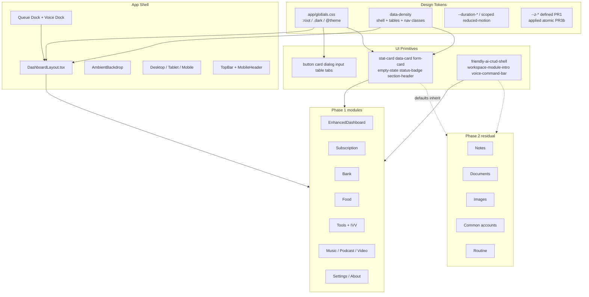
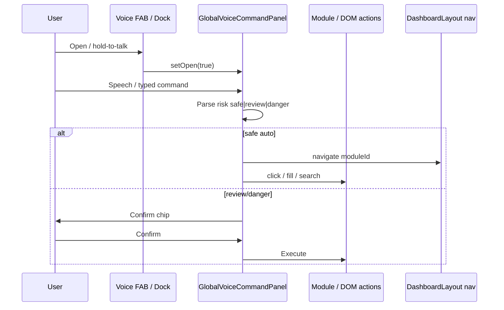
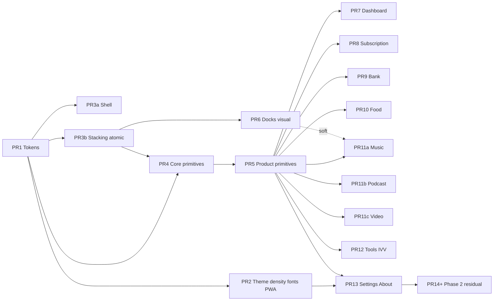
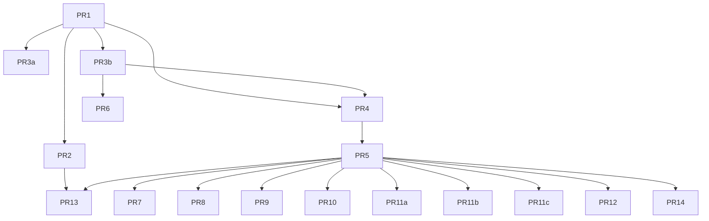

# Impeccable 2026–2027 UI/UX System Redesign

| Field | Value |
| --- | --- |
| **Product** | 鋒兄AI管理系統 (FengBro AI Management System) |
| **Workspace** | `D:\codex\fengbroaiappwrite` |
| **Author** | _TBD_ |
| **Date** | 2026-07-13 |
| **Status** | Draft (Rev 2.1 — stacking completeness + policy nits) |
| **Related stack** | Next.js 16 canary + Turbopack, React 19, Tailwind CSS v4, shadcn-style Radix primitives, Appwrite, Lucide; **system + CJK sans** with optional Geist via `next/font` (see KD-15) |

---

## Overview

FengBro is a bilingual (zh-TW primary) household digital console: subscriptions, bank/e-ticket balances, food inventory, media queues, documents, voice commands, and FFmpeg-backed media tools. The product already began an “Impeccable 2026” visual pass—OKLCH tokens, glass panels, serif display titles, gold-amber brand, and a polished shell in `components/layout/DashboardLayout.tsx`—but quality is uneven. Core shell and a few primitives (`StatCard`, `DataCard`, `SectionHeader`) speak the new language; many modules and primitives still use Tailwind `gray-*` / `blue-*` / purple-gradient starter patterns (`EmptyState`, `FormCard`, `StatusBadge`, large sections of `EnhancedDashboard`, `SubscriptionManagement`, queue chrome, scroll nav).

This document defines a **product + visual + interaction system** that completes the Impeccable 2026–2027 bar: editorial calm, soft spatial depth, typography-first hierarchy, intentional OKLCH brand, production-grade component craft, WCAG 2.2 AA, PWA/mobile shell integrity, and a **token-first migration** that ships incrementally without a big-bang rewrite or stack swap.

**Rev 2** tightens implementability: scoped density (not global Tailwind reflow magic), residual-module Phase 2 policy, atomic z-index rollout, scoped reduced-motion, contrast matrix for tokens, split media PRs, operational acceptance/CI gates, and FOUC boot isolation from SW/VAPID.

**Rev 2.1** completes the stacking consumer set (Select/popover, ImageEditor, legacy scroll-nav, video-screenshot toast), locks mobile-drawer-vs-dock policy, aligns KD-16 one-liner with the full ladder, and adds the FoodManagement file path to module recipes.

---

## Background & Motivation

### Current state (repo facts)

| Layer | Path / pattern | Maturity |
| --- | --- | --- |
| Tokens | `app/globals.css` (`:root` / `.dark`, `@theme inline`) | Strong foundation: OKLCH primary ~hue 72–84, `--panel-*`, `--line-*`, `--shadow-*`, `--accent-strong`. Missing semantic success/warning/info; `.surface-inset` uses hardcoded white rgba (weak in dark) |
| Shell | `components/layout/DashboardLayout.tsx` | Advanced: AmbientBackdrop (hardcoded rgba), desktop/tablet/mobile sidebars, TopBar, safe-area main padding, queue + voice mounts. Mobile header `z-40`; main max-width `1680px` |
| Theme | `components/providers/theme-provider.tsx` + `app/layout.tsx` | Functional light/dark/system via `ui-theme`; **no FOUC script**; class toggled after hydrate; no density |
| Viewport / PWA | `app/layout.tsx` exports `viewport.themeColor: "#c79541"`; orphan **`app/viewport.ts`** still has `#3b82f6` and is **not imported**; `public/manifest.json` `theme_color: #3b82f6`; SW `v10` |
| Primitives | `components/ui/*` | Split: token-aware (`stat-card`, `data-card`, `section-header`) vs gray/blue (`empty-state`, `form-card` default `accentColor="from-blue-500 to-blue-600"`, `status-badge`, `friendly-ai-crud-shell` tones without dark variants) |
| Modules | `components/modules/*` | Up to ~4.3k LOC; mixed visual systems; Notes uses `FormCard accentColor="from-purple-500 to-purple-600"` |
| Voice | `global-voice-command-panel.tsx`, `voice-command-bar.tsx` (`accent?: "emerald" \| "sky"` only) | Capable; chrome not fully tokenized; docks share `z-50` with dialogs |
| Stacking today | Dialog, Select portal, ImageEditor, queues, voice, both scroll-navs, mobile drawer, module modals | Nearly all **`z-50`**; birthday `z-[80]`/`z-[81]`; screenshot toast `z-[101]`; some module `z-[70]`/`z-[100]`/`9999` |
| Media tooling | `ImageVoiceVideoTool.tsx`, `/api/image-voice-video/*` | Must remain behavior-stable; UI shell only |
| Fonts | `globals.css` references `var(--font-geist-sans)` | **Geist not loaded** via `next/font` or CSS `@font-face`—system/CJK fallbacks apply |

### Pain points

1. **Visual schizophrenia** — Same screen may mix `surface-panel` glass with `bg-white dark:bg-gray-800` cards and blue CTA gradients.
2. **Dashboard clutter residues** — `EnhancedDashboard` still uses blue/indigo/purple “AI starter kit” blocks and ASCII art that fight editorial hierarchy.
3. **Primitive debt** — `FormCard` defaults blue gradient accent; `EmptyState` / `StatusBadge` ignore brand tokens; Notes/CommonAccount pass purple/blue accents.
4. **Numeric density without tabular nums** — Bank, subscription, finance figures lack `font-variant-numeric: tabular-nums`.
5. **Theme flash & PWA color drift** — System theme applied post-mount; install chrome and orphan `viewport.ts` still blue.
6. **No density mode** — Comfortable-only spacing; power users (bank/subscription tables) need compact option **on shell/tables/nav**, not a fantasy global reflow of every Tailwind `p-*`.
7. **Motion inconsistency** — `card-hover` uses `duration-300`; brief calls for 120–240ms ease-out + scoped `prefers-reduced-motion`.
8. **Module size** — Multi-thousand-line modules make pure “rewrite UI” risky; must evolve shells/primitives first so modules inherit polish; residual modules need an explicit Phase 2 policy.
9. **Z-index pile-up** — Everything at `z-50` means docks can fight dialogs; migration must be atomic.

### Why now

The shell already advertises “Design Mode · Impeccable 2026”. Completing the system now locks brand, reduces per-module CSS drift, and raises perceived quality for high-traffic finance/media workflows without touching Appwrite contracts or FFmpeg convert pipelines.

---

## Goals & Non-Goals

### Goals

1. Establish a **single design language** (tokens + semantic utilities + refined primitives) used by shell, Phase-1 high-traffic modules, voice, and media queues—with **documented** Phase-2 residual modules and primitive inheritance that auto-improves them.
2. Deliver **WCAG 2.2 AA** for specified token pairs (see contrast matrix); visible focus rings; ≥44px touch targets on coarse pointers; icon-only `aria-label`s.
3. Preserve **zh-TW natural copy** and bilingual micro-labels (EN tracking eyebrows + Chinese titles) already in shell.
4. Ship via **incremental, independently reviewable PRs** (≤ ~3k LOC intentional UI touch per module PR) with CSS variable backward compatibility.
5. Optional **comfortable / compact** density via **scoped** layout classes (shell, nav, tables, form stacks)—not automatic reflow of all Tailwind utilities.
6. Align **PWA + theme** (no flash, consistent theme_color, reconcile orphan viewport, safe areas).
7. Keep **media tooling and convert APIs** behavior-identical; redesign chrome only.

### Non-Goals

- Migrating off Next.js App Router, Tailwind v4, or Appwrite.
- Introducing a new component library (MUI, Mantine, Chakra, etc.).
- Heavy CSS-in-JS / runtime theme engines.
- Redesigning backend schemas, voice NLU grammar, or FFmpeg server logic.
- Pixel-cloning Apple / Linear / Arc; only matching *adjacent polish*.
- Full i18n framework (next-intl); continue inline zh-TW with optional EN eyebrows.
- Global `*` reduced-motion kill-switch (breaks Plyr/Monaco/Radix).
- Claiming every top-nav module is fully class-purged in Phase 1 (see KD-13).

---

## Visual Direction (Prose)

### Light mode — “Warm parchment console”

Imagine a late-afternoon editorial desk: paper-warm field (`oklch ~0.96 / 0.015 / 84`), soft gold light from upper-left, a quiet sage secondary pool at upper-right. Content lives on frosted **parchment panels** with 1px hairline borders (`--line-soft`), not hard gray boxes. Titles set in serif display (“Iowan / Palatino / Noto Serif TC”) with tight tracking; body is system UI sans + PingFang TC / Microsoft JhengHei (Geist optional once wired). Primary actions are **deep amber-bronze** (not neon yellow); status uses restrained rose/amber/emerald tints, never pure Tailwind default blue for brand actions.

### Dark mode — “Forest night desk”

Deep olive-charcoal base (`oklch ~0.18 / 0.014 / 150`), lifted cards at ~0.22, gold accent brighter for legibility. Glass panels use dark veils (`--panel-strong` rgba 22,28,24). Avoid pure black and neon cyan; keep warm highlights so finance figures feel premium, not cyberpunk.

### Interaction feel

- Surfaces separate by **0.5–1px lines + soft shadow**, not thick borders.
- Hover: 1–2px lift or subtle fill change in **160–200ms ease-out**; no bouncy springs.
- Active nav: gold gradient pill with **`--accent-foreground` text on gradient endpoints that meet AA** (see contrast matrix).
- Empty states: calm icon disk on muted panel, one sentence, one primary action.
- Voice panel: native dock language shared with music/podcast/video queues.
- Birthday easter egg: retain confetti; amber/rose only; under `prefers-reduced-motion` → static badge only.

### Anti-patterns (explicit ban)

- Purple/blue “AI gradient” hero text (`from-blue-600 to-purple-600`).
- Default Tailwind `bg-blue-500` primary CTAs.
- `FormCard` purple/blue accent gradients (including Notes/CommonAccount call sites after defaults change).
- Rainbow multi-gradient stat cards without semantic meaning.
- Competing chrome: multiple sticky bars with different blur strengths.
- Dense emoji walls as primary navigation affordances.

---

## Key Decisions

| # | Decision | Rationale |
| --- | --- | --- |
| KD-1 | **Evolve tokens in `app/globals.css` + Tailwind `@theme`**, not a new theme package | Existing OKLCH + panel tokens already map to shell; modules partially consume them. Lowest migration cost. |
| KD-2 | **Token-first primitives before module rewrites** | `FormCard` / `EmptyState` / `StatusBadge` / `FriendlyAiCrudShell` multiply polish across 15+ modules without rewriting 4k-line files. |
| KD-3 | **Keep gold-amber brand (hue 72–84)**; retire blue as brand primary | Aligns layout `themeColor` `#c79541`, accent gradients, premium console identity. Cool-blue **only** for semantic `info` / chart-3 (not CTAs). |
| KD-4 | **Semantic surface utilities**: `.surface-panel`, fix `.surface-inset`, add `.surface-raised`, `.surface-floating`, `.tabular-nums`, density layout classes | Prefer CSS classes over ad-hoc `rgba` in modules; fix dark inset. |
| KD-5 | **Density is scoped, not global Tailwind reflow** | `data-density` on `<html>` drives **explicit** classes (`.pad-panel`, `.gap-stack`, `.nav-item`, table row min-height, shell main padding). Arbitrary Tailwind `p-4` / `gap-4` in modules **do not auto-compact** until migrated to those classes. See [Density mechanism](#density-mechanism-implementable). |
| KD-6 | **FOUC-safe theme boot script** as a **separate early `<head>` script**, isolated from SW/VAPID IIFE | Avoids entangling with large existing `dangerouslySetInnerHTML` block; pairs with `suppressHydrationWarning` on `<html>`. |
| KD-7 | **Queue + voice share a “Dock System”** | Unify radius, blur, safe-area; z-index only via stacking PR (KD-16). |
| KD-8 | **No new component library**; extend CVA variants on existing shadcn-style primitives | Matches constraint; keeps Radix a11y. |
| KD-9 | **Finance/table modules prioritize tabular nums + compact density on shell/table classes** | Bank + subscription are high-traffic numeric surfaces. |
| KD-10 | **Incremental PR plan (foundation → stacking → primitives → Phase-1 modules → Phase-2 residual)** | Each PR mergeable; additive CSS vars. |
| KD-11 | **Manifest/theme_color → brand gold**; delete or reconcile orphan `app/viewport.ts`; SW bump only if precache needs invalidation | Removes blue reintroduction risk. |
| KD-12 | **Motion tokens + scoped reduced-motion** | Encode 120–240ms; reduce only design-system classes/keyframes—**never** global `* { !important }`. Allowlist Plyr/Monaco/PDF. |
| KD-13 | **Phase-1 vs Phase-2 residual module policy** | Phase 1: shell, primitives, docks, Dashboard, Subscription, Bank, Food, Tools+IVV, Music, Podcast, Video, Settings/About. Phase 2 (optional PR14+): Notes, CommonDocument, ImageGallery, CommonAccount, Routine. Phase 1 still **requires** primitive defaults so residual FormCard/EmptyState/shell chrome auto-improves; class-level gray purge is Phase 2 debt (documented severity Medium). |
| KD-14 | **Testing bar** | Required: `tests/menu-smoke.spec.js` + manual light/dark shell pass + contrast matrix for PR1. Optional: screenshots light/dark for primitives; CI `rg` banned-class gates on listed ui files. No Chromatic/Storybook requirement for Phase 1. |
| KD-15 | **Wire Geist via `next/font` in PR2** (or document intentional defer) | **Default: wire Geist Sans + Mono** on `<html>`/`body` in PR2 so `var(--font-geist-sans)` resolves. Fallback stack remains PingFang TC / Microsoft JhengHei. If bundle size is a concern, ship system stack only and stop marketing “Geist” until wired. |
| KD-16 | **Z-index token adoption is atomic (PR3b Stacking)** | PR1 only **defines** `--z-*` variables; no consumer migrates until a dedicated stacking PR updates **all** shared portaled/fixed chrome together (see [PR3b consumer inventory](#pr3b-consumer-inventory)). **Full order:** `toast ≥ easter ≥ popover ≥ modal > voice > drawer-open > expanded dock > collapsed dock > sidebar > sticky`. **Mobile drawer default:** open drawer+scrim use `--z-drawer-open` (72) **above** docks; docks (and voice FAB) are `inert` / `pointer-events-none` while drawer is open so nav taps are not stolen. **Popover/Select:** portaled to `document.body` must use `--z-popover` **≥ `--z-modal`** so menus work inside dialogs. |
| KD-17 | **Open Question defaults (locked)** | (1) Density toggle in **sidebar Design Mode card + Settings** (PR2 minimal in Design Mode; PR13 Settings polish). (2) **ASCII art retained** monochrome (`text-muted-foreground font-mono`). (3) **MediaQueueShell optional v1.1**—PR6 visually aligns three panels independently without shared component. (4) **`info` stays cool-slate-blue** (hue ~230), never used for primary CTAs. |

---

## Proposed Design

### Architecture



### Information architecture (unchanged routing)

Module switching remains client-side in `app/page.tsx` via `currentModule` + lazy `dynamic()` imports. Visual redesign must not alter module IDs used by voice navigation (`MODULE_VOICE_META` in `global-voice-command-panel.tsx`).

### Residual modules & primitive inheritance (Phase 2 policy)

| Module | Path | ~LOC | Phase | Auto-improves after PR5? | Still needs class purge? |
| --- | --- | --- | --- | --- | --- |
| Notes | `NotesManagement.tsx` | ~2338 | **2** | Yes: `FormCard` (kills purple accent default), `EmptyState` | Yes: local gray/purple utilities |
| Common documents | `CommonDocumentManagement.tsx` | ~3297 | **2** | Yes: `FriendlyAiCrudShell`, `EmptyState` | Yes: list/grid chrome |
| Images | `ImageGallery.tsx` | ~2491 | **2** | Yes: shell + empty | Yes: gallery cards |
| Common accounts | `CommonAccountManagement.tsx` | ~1707 | **2** | Yes: `FormCard` default (was blue accent prop) | Yes: form layouts |
| Routine | `RoutineManagement.tsx` | ~1485 | **2** | Yes: `FormCard` | Yes: schedule UI |

**Phase 1 acceptance for residual paths:** After PR5, `FormCard` **ignores decorative accent gradients** (always brand rail)—so Notes purple / CommonAccount blue props become no-ops. Optional CI grep: no `from-blue-500|from-purple-500` in `components/modules/**` once Phase 2 complete; after PR5, ban those strings inside `components/ui/form-card.tsx` defaults.

**Debt severity if Phase 2 slips:** Medium — users still see gray list shells on 筆記/文件/圖片/常用/例行, but shell chrome, empty states, form rails, and workbench headers should already look Impeccable.

### Design language pillars

1. **Editorial calm** — One primary surface (`.surface-panel` main chrome); secondary cards as inset/raised; reduce nested borders.
2. **Soft spatial depth** — Max 3 elevation steps: field → panel → floating dock/dialog.
3. **Typography-first** — Display titles + muted micro-labels + strong body contrast; tabular nums for money/dates.
4. **Brand restraint** — Gold for primary/active; sage for secondary charts; semantic rose/amber/emerald for status; cool `info` only for informational chips.
5. **Native voice/media docks** — Same glass language as shell.

### Elevation model

| Level | Token / class | Use |
| --- | --- | --- |
| 0 Field | `--background` + AmbientBackdrop | Page canvas |
| 1 Panel | `.surface-panel` | Main content frame, sidebars |
| 2 Raised | `.surface-raised` (new) | Stat cards, list containers |
| 3 Floating | `.surface-floating` (new) | Dialogs, mobile drawer, queues, voice panel |
| Veil | `--panel-veil` | Sticky headers, TopBar |

### Density mechanism (implementable)

**Problem:** Most spacing is Tailwind utilities (`p-5`, `gap-4`, `py-3` in layout/modules). Changing CSS variables alone does **not** compact those classes.

**Solution: scoped density (option A + limited layout utilities).**

1. Set `document.documentElement.dataset.density` = `comfortable` | `compact` (default comfortable; persist `ui-density`).
2. Introduce **density-aware layout classes** that read CSS variables:

```css
:root {
  --pad-panel: 1.25rem;      /* ~p-5 */
  --pad-panel-xl: 2rem;      /* ~p-8 */
  --gap-stack: 1rem;         /* ~gap-4 */
  --nav-item-py: 0.75rem;    /* py-3 */
  --table-row-min: 2.75rem;  /* 44px */
}
html[data-density="compact"] {
  --pad-panel: 0.75rem;
  --pad-panel-xl: 1.25rem;
  --gap-stack: 0.75rem;
  --nav-item-py: 0.5rem;
  --table-row-min: 2.25rem;  /* 36px desktop */
}
.pad-panel { padding: var(--pad-panel); }
@media (min-width: 1280px) {
  .pad-panel { padding: var(--pad-panel-xl); }
}
.gap-stack { gap: var(--gap-stack); }
.nav-item { padding-top: var(--nav-item-py); padding-bottom: var(--nav-item-py); }
.table-row-density { min-height: var(--table-row-min); }
```

3. **Migrate only these surfaces in Phase 1:**
   - Shell main content wrapper + sidebar nav items (`DashboardLayout.tsx`)
   - `FriendlyAiCrudShell` outer stack gaps
   - `TableRow` / high-traffic tables in Subscription + Bank (add `.table-row-density` / `tabular-nums`)
   - Form stacks that already use `FormGrid` / `FormActions` (optional gap via `.gap-stack`)

4. **Explicit non-promise:** Module-local `className="p-4 gap-4"` hardcodes **remain comfortable until that file is migrated**. Compact mode is still valuable for shell chrome + finance tables without rewriting the world.

5. **Touch safety:** `@media (hover: none) and (pointer: coarse)` keeps control min sizes ≥44px regardless of density (existing globals pattern). Compact table rows may stay 44px on coarse pointers:

```css
@media (hover: none) and (pointer: coarse) {
  html[data-density="compact"] .table-row-density { min-height: 2.75rem; }
}
```

### Motion

| Token | Value |
| --- | --- |
| `--duration-instant` | 80ms |
| `--duration-fast` | 120ms |
| `--duration-normal` | 160ms |
| `--duration-moderate` | 200ms |
| `--duration-slow` | 240ms |
| `--ease-out` | `cubic-bezier(0.16, 1, 0.3, 1)` |

**Scoped reduced-motion (do not use global `*`):**

```css
@media (prefers-reduced-motion: reduce) {
  .transition-impeccable,
  .card-hover,
  .nav-item,
  .nav-item-active {
    transition-duration: 0.01ms !important;
    transform: none !important;
  }
  .birthday-confetti,
  [data-birthday-confetti] {
    animation: none !important;
    display: none; /* keep static badge only via component branch */
  }
  .voice-listen-pulse {
    animation: none !important;
  }
}
```

**Allowlist (never force-disable via global CSS):** Plyr / `.plyr`, Monaco editor, `react-pdf` / PDF.js canvas, Radix dialog/presence unless a specific design-system wrapper owns the animation class. Prefer component-level: birthday and voice already branch on `matchMedia('(prefers-reduced-motion: reduce)')`.

Update `.card-hover` from `duration-300` → `duration-[var(--duration-moderate)]` + ease-out (or `.transition-impeccable`).

### Z-index scale & stacking policy

| Token | Value | Use |
| --- | --- | --- |
| `--z-base` | 0 | Content |
| `--z-sticky` | 40 | Mobile header (current `z-40`); e.g. `MusicLyrics` bottom bar if kept sticky |
| `--z-sidebar` | 50 | Reserved / closed-state chrome only—**not** the open mobile drawer |
| `--z-dock` | 60 | Media queues collapsed |
| `--z-dock-expanded` | 70 | Expanded queue sheet |
| `--z-drawer-open` | 72 | **Open** mobile nav drawer + scrim (above all docks) |
| `--z-voice` | 75 | Global voice panel / FAB |
| `--z-modal` | 80 | Dialog overlay + content; fullscreen editors (ImageEditor); module ad-hoc modals |
| `--z-popover` | 85 | **Portaled** Select/Popover/Dropdown content (`document.body`); must be **≥ modal** |
| `--z-easter` | 88 | Birthday confetti + badge (pointer-events none; above modal chrome) |
| `--z-toast` | 90 | Transient toasts (incl. `video-screenshot-button` success chip) |

**Full ladder (high → low):**  
`toast (90) ≥ easter (88) ≥ popover (85) ≥ modal (80) > voice (75) > drawer-open (72) > dock-expanded (70) > dock (60) > sidebar (50) > sticky (40) > base (0)`.

**Runtime policy:**

| Situation | Winner | Notes |
| --- | --- | --- |
| Dialog open | Modal (`--z-modal` 80) | Overlay blocks docks; focus trap on dialog |
| Select / menu **inside** Dialog | Popover (`--z-popover` 85) | Portaled to body—**must** exceed modal or menus clip under overlay (classic shadcn bug when only dialog z rises) |
| Select open with queue visible | Popover ≥ dock | Select always 85; queues 60–70 |
| Voice open + dialog open | Modal still wins for focus | Defer voice confirm if focus conflict |
| Expanded queue + voice | Voice (75) above dock-expanded (70) | Both may be open |
| **Mobile drawer open** | **Drawer-open (72) above docks** | **Locked default (KD-16):** (1) drawer scrim+panel use `z-[var(--z-drawer-open)]`; (2) while `isSidebarOpen`, set music/podcast/video queue roots **and** voice dock root to `inert` + `pointer-events-none` (or `hidden`) so bottom/right FABs cannot steal taps; (3) restore docks on close. Manual QA: narrow viewport, open menu, tap every nav row without hitting queue/voice. |
| Birthday | Easter 88 | Non-interactive confetti; does not trap focus |
| Screenshot / ephemeral success | Toast 90 | Map `video-screenshot-button` from ad-hoc `z-[101]` → `--z-toast` |
| Fullscreen ImageEditor | Modal 80 | Same band as dialogs; closes over docks/voice |

#### PR3b consumer inventory

PR1 **defines** all `--z-*` only. **PR3b** migrates every **shared** fixed/portaled layer in `components/ui/*` + shell drawer in **one** merge. Do not ship dock z without dialog **and** Select/popover.

| File | Current (repo) | Target token |
| --- | --- | --- |
| `components/ui/dialog.tsx` | overlay + content `z-50` | `--z-modal` (80) |
| `components/ui/select.tsx` | `SelectContent` `z-50` (Portal) | `--z-popover` (85) |
| `components/ui/music-queue-panel.tsx` | `z-50` | `--z-dock` / expanded as appropriate |
| `components/ui/podcast-queue-panel.tsx` | `z-50` | `--z-dock` / expanded |
| `components/ui/video-queue-panel.tsx` | `z-50` | `--z-dock` / expanded |
| `components/ui/global-voice-command-panel.tsx` | `z-50` | `--z-voice` (75) |
| `components/ui/enhanced-scroll-navigation.tsx` | `z-50` | `--z-dock` (60) — same band as collapsed chrome FABs |
| `components/ui/scroll-navigation.tsx` | `z-50` (legacy) | Same as enhanced **or** delete if unused; still migrate if file remains |
| `components/ui/image-editor.tsx` | fullscreen `z-50` | `--z-modal` (80) |
| `components/ui/video-screenshot-button.tsx` | dynamic toast `z-[101]` | `--z-toast` (90) |
| `components/ui/birthday-easter-egg.tsx` | `z-[80]` / `z-[81]` | `--z-easter` (88) |
| `components/layout/DashboardLayout.tsx` | mobile drawer root `z-50`; header `z-40` | open drawer `--z-drawer-open` (72); header `--z-sticky` (40); wire dock inert while open |

**Local stacking (not body-portaled)—document only in PR3b, optional one-line fix:**

| Location | Notes |
| --- | --- |
| `friendly-ai-crud-shell.tsx` recent-search `absolute z-50` | Lives inside a positioned parent; **local** stacking context. Prefer `z-10`/`z-20` relative to the shell, **not** global `--z-popover`, unless the panel is re-portaled to `body`. One-line note in PR3b is enough. |

**Module ad-hoc modals (Phase 1 module PRs, not all in PR3b):**  
Many modules use `fixed inset-0 … z-50` (Bank, Food, Subscription, Music, …) and occasional `z-[70]` / `z-[100]` / `zIndex: 9999` (e.g. Subscription `AccountComboBox`). **Rule:** when a module PR touches that chrome, map overlays to `z-[var(--z-modal)]` and portaled comboboxes to `z-[var(--z-popover)]`. Optional fast-follow: shared `ModalScrim` helper later. PR3b does **not** have to edit every module file if shared Dialog/Select cover the primary paths—but Bank/Food **Select** correctness depends on **select.tsx** in PR3b.

**PR3b acceptance (manual):**

1. Open music queue (collapsed) → open Bank form Select → menu appears **above** queue.
2. Open Dialog → open Select **inside** dialog → menu above dialog overlay; items clickable.
3. Mobile width → open nav drawer → docks/voice do not intercept taps; all menu rows work.
4. Trigger video screenshot toast → appears above dialog if both shown; uses toast band not `101`.
5. ImageEditor fullscreen covers docks.
6. Birthday day (or forced content) sits above modal chrome without blocking clicks (pointer-events none).

### Shell redesign details (`DashboardLayout.tsx`)

**Keep:** Three breakpoints, BrandBlock, StatusPill, sleep warning, queue/voice mounts, max width `1680px`, safe-area bottom padding for docks.

**Refine:**

1. Extract `AmbientBackdrop` to `components/ui/ambient-backdrop.tsx` with props contract (below); gradients from CSS variables.
2. Keep TopBar; token borders only.
3. Unify active menu as `.nav-item-active` + density `.nav-item`.
4. Tablet rail: `title` + `aria-current="page"`.
5. Mobile menu: `aria-expanded`, `aria-controls="mobile-sidebar"`.
6. Density toggle in Design Mode card (PR2); Settings polished later (PR13).
7. Birthday: reduced-motion static branch.

### Voice UX integration



**Visual:** `.surface-floating`, listening ring via `.voice-listen-pulse` (scoped reduced-motion), risk chips via tokenized `StatusBadge`, `VoiceCommandBar` `accent="brand"` (emerald/sky → aliases).

### Module-level visual recipes (Phase 1)

#### EnhancedDashboard — touch anchors

- **File:** `components/modules/EnhancedDashboard.tsx`
- **Chrome targets:** masthead/ASCII (`FENG_BRO_ASCII`), `StatCard` grid (~line with `gradient="from-blue-500…"`), notification banners (`bg-blue-50`, `from-blue-600 to-purple-600`), section headers for food/subscription stats.
- **Do not change:** `useDashboardStats` / `useMediaStats` logic, fetch to `/api/fengbro-tube` / `/api/fengbro-finance`, navigation callbacks.
- **ASCII:** retain monochrome `text-muted-foreground font-mono`.

#### SubscriptionManagement — touch anchors

- **File:** `components/modules/SubscriptionManagement.tsx`
- **Chrome:** `SubscriptionPriceDisplay` (`text-gray-900` → `text-foreground tabular-nums`); table header/rows; toolbar buttons; expiry badges; workbench shell if present.
- **Sticky header:** `TableHeader` with `bg-[color:var(--panel-veil)] backdrop-blur sticky top-0 z-[1]` inside scroll container (module-local, not global z scale).
- **Logic freeze:** CSV import/export, delete confirmation string `DELETE subscription`, voice commands, `useSubscriptions`.

#### BankManagement — touch anchors

- **File:** `components/modules/BankManagement.tsx`
- **Chrome:** balance displays near `formatCurrency`; `FormCard` title blocks; `FriendlyAiCrudShell`; empty states; bulk/transaction dialog chrome.
- **Logic freeze:** `bankBulkAmount`, CSV, voice risk, `useBanks`.

#### FoodManagement — touch anchors

- **File:** `components/modules/FoodManagement.tsx`
- **Chrome:** expiry `StatusBadge` (list + inline form status chips); list/section `DataCard` / empty states (`EmptyState` emoji paths); `FormCard` title blocks with `accentColor="from-blue-500 to-blue-600"` (no-op after PR5 brand rail); `FriendlyAiCrudShell` workbench header; ad-hoc `fixed inset-0 z-50` confirm/modals → `z-[var(--z-modal)]` when touched.
- **Logic freeze:** expiry calculations (`getFoodFormExpiryInfo` / days remaining), CRUD hooks, voice/CSV if present.

#### ToolsManagement + ImageVoiceVideoTool

- Tabs chrome; IVV progress/result panels as raised surfaces.
- **Forbid** edits under `app/api/image-voice-video/**` and `lib/imageVoiceVideo/resolveFfmpeg.ts` in UI PRs.

#### Music / Podcast / Video (separate PRs)

- Library cards, headers, empty states; player chrome only if safe.
- Queues already docked in PR6—modules should not re-stack z-index.
- **Logic freeze:** queue hooks, cache hooks, multipart upload.

#### Settings / About

- **PR2:** density API + Design Mode sidebar toggle only (minimal Settings optional one-liner if needed).
- **PR13:** full Settings visual polish + About editorial; Appwrite forms tokenized inputs.

#### Phase 2 residual (PR14+)

- Class purge only after Phase 1 stable; same “no logic hunk” rule.

---

## Design Tokens

### Principles for PR1

- Present **Current | Proposed | Rationale**.
- Load-bearing changes: add semantic colors; fix `.surface-inset`; add motion/z/density layout vars; slight AA tweaks to muted-foreground if matrix fails.
- Aesthetic-only tweaks (e.g. background `0.96` → `0.965`) are optional and may be **deferred**—prefer keep current if contrast already passes.

### Color — Light (`:root`)

| Token | Current (`app/globals.css`) | Proposed | Rationale / AA |
| --- | --- | --- | --- |
| `--background` | `oklch(0.96 0.015 84)` | **Keep** (optional `0.965 0.014 84`) | Field; already warm parchment |
| `--foreground` | `oklch(0.23 0.02 88)` | **Keep** or `0.22 0.02 88` | Primary text vs bg ≥4.5:1 (target ~12:1) |
| `--card` | `oklch(0.985 0.012 84)` | Keep | Opaque fallback |
| `--primary` | `oklch(0.42 0.11 74)` | Keep | Bronze fill; text uses `--primary-foreground` |
| `--primary-foreground` | `oklch(0.985 0.01 84)` | Keep | On primary ≥4.5:1 |
| `--accent` | `oklch(0.72 0.115 73)` | Keep | Highlight / gradient end |
| `--accent-strong` | `oklch(0.59 0.13 72)` | Keep | Gradient start / strong gold |
| `--accent-foreground` | `oklch(0.17 0.018 88)` | Keep | **Required on active nav gradient** |
| `--muted` | `oklch(0.94 0.012 84)` | Keep | |
| `--muted-foreground` | `oklch(0.49 0.02 82)` | **`oklch(0.45 0.02 82)` if AA fails** | Secondary text vs `--background` ≥4.5:1 |
| `--destructive` | `oklch(0.58 0.17 28)` | `oklch(0.55 0.17 28)` optional | Errors |
| `--success` | *(missing)* | `oklch(0.45 0.11 152)` | New; pair with light fg on solid or dark text on tint |
| `--success-foreground` | *(missing)* | `oklch(0.98 0.01 152)` | On solid success |
| `--warning` | *(missing)* | `oklch(0.75 0.12 75)` | Tint-friendly |
| `--warning-foreground` | *(missing)* | `oklch(0.28 0.04 75)` | Text on warning tint |
| `--info` | *(missing)* | `oklch(0.50 0.07 230)` | Semantic only (KD-17) |
| `--info-foreground` | *(missing)* | `oklch(0.98 0.01 230)` | On solid info |
| `--panel-strong` | `rgba(255,252,246,0.82)` | `0.86` alpha optional | Glass |
| `--panel-soft` | `rgba(255,255,255,0.62)` | Keep | |
| `--panel-veil` | `rgba(255,250,242,0.72)` | `0.78` optional | Sticky |
| `--line-soft` / `--line-strong` | existing | Keep | |
| `--shadow-soft` / `--shadow-strong` | existing | Keep | |
| `--shadow-dock` | *(missing)* | `0 12px 40px rgba(62,54,38,0.14)` | Docks |
| `--ring` | `oklch(0.67 0.1 73)` | Keep | Focus |

### Color — Dark (`.dark`)

| Token | Current | Proposed | Rationale / AA |
| --- | --- | --- | --- |
| `--background` | `oklch(0.18 0.014 150)` | **Keep** | Prefer keep unless matrix wants deeper |
| `--foreground` | `oklch(0.94 0.01 84)` | Keep | |
| `--primary` | `oklch(0.73 0.11 73)` | **`oklch(0.78 0.11 73)` if solid primary buttons fail AA** with dark fg | Large UI may use 3:1 |
| `--primary-foreground` | `oklch(0.17 0.014 150)` | Keep | |
| `--muted-foreground` | `oklch(0.72 0.01 84)` | **Raise to `oklch(0.78 0.015 84)` if &lt;4.5:1 on bg/card** | Known risk |
| `--success` | *(missing)* | `oklch(0.72 0.11 152)` | |
| `--warning` | *(missing)* | `oklch(0.80 0.11 75)` | |
| `--info` | *(missing)* | `oklch(0.72 0.07 230)` | |
| `--panel-*` | existing | Slight alpha +0.04 optional | |
| `--destructive` | `oklch(0.67 0.16 28)` | Keep | |

### Contrast matrix (PR1 acceptance gate)

Ratios below are **targets** to verify with an OKLCH contrast tool or browser DevTools before merging PR1. Adjust tokens until pass; do not merge “hopeful” values.

| Pair | Min ratio | Notes |
| --- | --- | --- |
| `--foreground` on `--background` (light/dark) | ≥ 4.5:1 | Body text |
| `--muted-foreground` on `--background` | ≥ 4.5:1 | Secondary text; dark is highest risk |
| `--muted-foreground` on `--card` | ≥ 4.5:1 | Cards slightly lifted |
| `--primary-foreground` on `--primary` | ≥ 4.5:1 | Buttons |
| `--accent-foreground` on `--accent-strong` | ≥ 4.5:1 | Active nav start stop |
| `--accent-foreground` on `--accent` | ≥ 4.5:1 | Active nav end stop |
| `--destructive` text on `--background` (or tint pattern) | ≥ 4.5:1 | Prefer `text-destructive` on light tint `destructive/10` |
| Icons / UI chrome (non-text) | ≥ 3:1 | Borders may be decorative &lt;3:1 |

**Tooling:** manual verification in PR1 description (paste ratios); optional axe DevTools on shell screenshot light+dark. No hard dependency on a specific npm package.

**Active nav:** Never put gold text on gold gradient. Always `--accent-foreground` (near-black / near-dark olive) on `linear-gradient(…, var(--accent-strong), var(--accent))`.

### Chart tokens (keep roles)

| Token | Semantic use |
| --- | --- |
| `--chart-1` | Gold / revenue |
| `--chart-2` | Sage / inventory |
| `--chart-3` | Cool slate-blue / storage (not brand CTA) |
| `--chart-4` | Lime-gold / secondary |
| `--chart-5` | Coral / alerts |

### Radius

| Token | Current | Proposed | Rationale |
| --- | --- | --- | --- |
| `--radius` | `1.25rem` | Keep | shadcn mapping |
| `--radius-sm/md/lg/xl` | calc from radius | Keep | |
| `--radius-2xl` | *(missing; shell uses `rounded-[28px]`)* | `1.75rem` | Optional convenience; **not required** if team prefers arbitrary values—add for `rounded-2xl` theme consistency |
| `--radius-3xl` | *(missing; shell `rounded-[32px]`)* | `2rem` | Same optional note |
| `--radius-pill` | N/A | `999px` | Chips |

### Typography scale (concrete utilities in PR1)

Define in `@layer components` (or `@utility` if preferred):

```css
.font-display { /* existing */ }
.text-display-xl {
  font-family: var(--font-display, "Iowan Old Style", "Palatino Linotype", "Noto Serif TC", serif);
  font-size: clamp(2rem, 1.5rem + 1.2vw, 2.5rem);
  line-height: 1.15;
  letter-spacing: -0.03em;
  font-weight: 600;
}
.text-display-l {
  font-family: var(--font-display, "Iowan Old Style", "Palatino Linotype", "Noto Serif TC", serif);
  font-size: clamp(1.75rem, 1.4rem + 0.8vw, 2rem);
  line-height: 1.2;
  letter-spacing: -0.03em;
  font-weight: 600;
}
.text-display-m {
  font-family: var(--font-display, "Iowan Old Style", "Palatino Linotype", "Noto Serif TC", serif);
  font-size: 1.5rem;
  line-height: 1.25;
  letter-spacing: -0.02em;
  font-weight: 600;
}
.text-micro {
  font-size: 0.6875rem;
  line-height: 1rem;
  letter-spacing: 0.28em;
  text-transform: uppercase;
}
.tabular-nums {
  font-variant-numeric: tabular-nums lining-nums;
}
```

**Font loading (KD-15):** PR2 wires:

```tsx
import { Geist, Geist_Mono } from "next/font/google"; // or local if preferred
// set --font-geist-sans / --font-geist-mono on html className
```

If `next/font/google` Geist is unavailable in the project’s Next version, use system stack only and document in PR2.

### Surface classes

| Class | Current | Proposed |
| --- | --- | --- |
| `.surface-panel` | gradient panels + blur | Keep; ensure dark uses dark panels |
| `.surface-inset` | **hardcoded white rgba** | Fix: use `color-mix` / `--panel-soft` / dark-aware inset so dark mode is not milky white |
| `.surface-raised` | missing | panel + stronger border/shadow |
| `.surface-floating` | missing | dock/dialog glass + `--shadow-dock` |

### Tailwind v4 `@theme` additions

```css
--color-success: var(--success);
--color-success-foreground: var(--success-foreground);
--color-warning: var(--warning);
--color-warning-foreground: var(--warning-foreground);
--color-info: var(--info);
--color-info-foreground: var(--info-foreground);
--shadow-soft: var(--shadow-soft);
--shadow-strong: var(--shadow-strong);
--shadow-dock: var(--shadow-dock);
--radius-2xl: var(--radius-2xl);
--radius-3xl: var(--radius-3xl);
--font-display: "Iowan Old Style", "Palatino Linotype", "Noto Serif TC", serif;
```

Enables `bg-success/10`, `text-success`, etc.

### Motion / density / z variables (PR1 define only)

- `--duration-*`, `--ease-out`
- `--pad-panel`, `--gap-stack`, `--nav-item-py`, `--table-row-min` (+ compact overrides under `html[data-density="compact"]`)
- `--z-sticky` … `--z-toast` including `--z-popover`, `--z-drawer-open` (**consumers wait for PR3b inventory**)

---

## API / Interface Changes

No REST/Appwrite contract changes.

### Theme provider

```ts
type Theme = "dark" | "light" | "system";
type Density = "comfortable" | "compact";

type ThemeProviderState = {
  theme: Theme;
  setTheme: (theme: Theme) => void;
  density: Density;
  setDensity: (density: Density) => void;
};
```

- Keys: `ui-theme`, `ui-density`.
- Apply `class` + `data-density` on `<html>`.
- Boot script (first in `<head>`, separate from SW/VAPID) mirrors the same rules.

### AmbientBackdrop props

```ts
// components/ui/ambient-backdrop.tsx
export type AmbientBackdropProps = {
  className?: string;
  /** default true — top highlight veil */
  showVeil?: boolean;
};
// Gradients: CSS variables --ambient-1, --ambient-2, --ambient-field set in globals for light/dark
```

### Button

| Change | Detail | Migration |
| --- | --- | --- |
| radius | Prefer `rounded-xl` for default/lg | Dense toolbars may pass `className="rounded-md"` to override |
| `size="touch"` | `min-h-11 min-w-11` | Opt-in; do not change default `icon` size globally if it breaks compact toolbars—use touch size on mobile headers only |
| motion | `.transition-impeccable` | |

### StatusBadge / EmptyState / FormCard / shells

As before: token styles; FormCard **deprecates `accentColor`** (ignored; brand rail always); FriendlyAiCrudShell tones map to semantic + dark variants; VoiceCommandBar `brand` + aliases; StatCard default brand gradient + `tabular-nums` on numeric values.

### MediaQueueShell

**Optional v1.1** (KD-17). PR6 does not require extract; if added later:

```ts
type MediaQueueShellProps = {
  title: string;
  expanded: boolean;
  onExpandedChange: (v: boolean) => void;
  children: React.ReactNode;
  footer?: React.ReactNode;
  className?: string;
};
```

### DensityToggle

```ts
type DensityToggleProps = { compact?: boolean; className?: string };
// cycles or binary comfortable/compact; aria-label 舒適/緊湊
```

---

## Data Model Changes

**None** for Appwrite.

| Key | Values | Consumer |
| --- | --- | --- |
| `ui-theme` | light \| dark \| system | ThemeProvider |
| `ui-density` | comfortable \| compact | ThemeProvider |

Missing `ui-density` → `comfortable`.

---

## Alternatives Considered

### Alt A — Full design system package regen

Rejected: high churn; fights partial Impeccable work.

### Alt B — CSS-in-JS

Rejected: constraints + Tailwind v4 `@theme`.

### Alt C — Big-bang module rewrites before tokens

Rejected: drift returns; PR conflicts.

### Alt D — Dual brand (blue tools, gold shell)

Rejected: schizophrenia. Cool blue allowed only as semantic `info` / chart-3.

### Alt E — Storybook/Chromatic-first visual system

- **Pros:** Regression safety.
- **Cons:** New infra, not in repo, delays shell/token wins.
- **Verdict:** Deferred. KD-14 uses smoke + manual + optional screenshots.

### Alt F — CSS-only density limited to shell (no module utilities)

- **Pros:** Smallest implementable density.
- **Cons:** Compact feels incomplete on tables.
- **Verdict:** **Accepted as Phase 1 baseline** and extended with `.table-row-density` / `.gap-stack` on finance tables and CRUD shell only (KD-5)—not full-app reflow.

---

## Security & Privacy Considerations

| Topic | Guidance |
| --- | --- |
| Secrets | Do not log Appwrite API keys from Settings. |
| Voice | Client-side STT patterns unchanged; no new third-party STT. |
| PWA / SW | Do not broaden SW cache of authenticated payloads. Bump SW version **only** when precached static assets (CSS/manifest icons) require invalidation. |
| FOUC boot script | **Separate** small inline script as first child of `<head>` (or immediately after charset). Must **not** be merged into the existing VAPID/SW `dangerouslySetInnerHTML` IIFE. Idempotent; try/catch localStorage. |
| XSS | No new HTML injection for decoration. |
| Contrast | AA failures on matrix pairs are release blockers for PR1. |

---

## Observability

| Signal | How |
| --- | --- |
| Theme/density | localStorage; Settings/Design Mode UI |
| Voice errors | Existing feedback strings |
| Convert failures | Unchanged APIs; destructive text styling only |
| Visual | Optional light/dark screenshots for shell + primitives in PR descriptions |
| Performance | Optional Lighthouse on home: record baseline in PR3 description (mobile emulation, mid-tier); flag if LCP regresses &gt;10% **after** blur changes—not a hard CI gate in Phase 1 |
| CI greps (optional) | See Acceptance |

---

## Rollout Plan



**Feature flags:** none required; density is preference.

**Rollback:** revert single PR; tokens additive.

**Parallel safety:** Module PRs (7–12) may proceed in parallel **after PR5 is merged** and freeze further edits to `components/ui/*` except hotfixes. Do not parallelize two PRs that both edit `DashboardLayout.tsx` or `globals.css`.

---

## Risk Register

| ID | Risk | Severity | Mitigation |
| --- | --- | --- | --- |
| R1 | Backdrop-filter jank | Medium | Reduce blur on coarse/low-end; solid fallback |
| R2 | Gold-on-gold / muted AA fail | High | Contrast matrix; accent-foreground on nav |
| R3 | Module merge conflicts | Medium | One large module per PR; no-logic template |
| R4 | Theme FOUC script mismatch | Medium | Same algorithm as ThemeProvider; isolated script |
| R5 | Compact shrinks touch targets | High | Coarse pointer min 44px; compact table exception |
| R6 | IVV/media API regression | High | Visual-only diffs; forbid API paths |
| R7 | PWA color drift / orphan viewport | Low | PR2 delete/reconcile `app/viewport.ts` |
| R8 | Z-index migration race | High | Atomic PR3b full inventory (include Select/popover + ImageEditor + toast); no partial dock-only z moves |
| R14 | Select under dialog/queue after z raise | High | `--z-popover` ≥ `--z-modal`; PR3b acceptance steps 1–2 |
| R15 | Mobile drawer under dock FABs | Medium | `--z-drawer-open` + inert docks/voice while open |
| R9 | Serif CJK missing | Low | Fallbacks |
| R10 | Birthday confetti perf | Low | Cap pieces; reduced-motion branch |
| R11 | Residual module schizophrenia | Medium | KD-13 Phase 2; PR5 defaults kill purple/blue FormCard rails |
| R12 | Global reduced-motion breaks Plyr | High | Scoped classes only (KD-12) |
| R13 | Density overpromise | Medium | Document non-reflow of raw Tailwind `p-*` |

---

## Acceptance Criteria — operationalized

### Per-PR slices

| PR | Done when |
| --- | --- |
| PR1 | Tokens added; contrast matrix filled with measured ratios ≥ gates; `.surface-inset` dark-fixed; `text-display-*` / density vars / `--z-*` defined; **no** consumer z-index migration; scoped reduced-motion CSS present |
| PR2 | FOUC script isolated; density API + Design Mode toggle; Geist wired or explicitly deferred in PR body; manifest gold; `app/viewport.ts` deleted or reconciled; apple status bar note if touched |
| PR3a | Shell uses density classes + token ambient; a11y attrs; birthday reduced-motion |
| PR3b | Full [consumer inventory](#pr3b-consumer-inventory) migrated; Select≥modal; drawer-open>docks + docks inert; smoke steps 1–6 in stacking section |
| PR4 | Core primitives token radii/focus; dialog uses modal z + floating surface |
| PR5 | empty-state/form-card/status-badge/friendly shell/workspace intro tokenized; FormCard accent no-op; optional `rg` clean on those files; light/dark manual screenshot in PR |
| PR6 | Queue + voice + scroll-nav visual tokens; **z-index already from PR3b**—no z fights |
| PR7–10 | Module greps: no new `from-blue-600 to-purple` / primary `bg-blue-500` in that file; tabular-nums on price/balance; **no logic hunk** |
| PR11a–c | One module each; playback smoke manual |
| PR12 | IVV convert/tts/translate manual smoke (steps below) |
| PR13 | Settings density/theme polished; About editorial; residual Phase 2 listed in release notes |
| PR14+ | Optional residual class purge |

### Foundation (release)

- [ ] Matrix pairs pass AA.
- [ ] Focus-visible on Button, Input, Select, Tabs, Dialog close, nav.
- [ ] Reduced-motion: confetti off, card-hover translate off; Plyr still animates controls as upstream allows.
- [ ] No theme flash on hard reload.
- [ ] Density toggles shell/nav/table density classes; raw module `p-4` may remain.

### CI / grep recipes (optional but recommended)

```bash
# After PR5 — banned hardcodes inside redesigned primitives
rg -n "gray-|blue-500|blue-600|purple-600" components/ui/empty-state.tsx components/ui/form-card.tsx components/ui/status-badge.tsx components/ui/workspace-module-intro.tsx

# After Phase 1 high-traffic modules
rg -n "from-blue-600 to-purple|from-purple-500 to-purple" components/modules/EnhancedDashboard.tsx components/modules/SubscriptionManagement.tsx
```

### IVV manual smoke (PR12)

1. Open 鋒兄工具 → 圖片語音影片.
2. Load sample image + short script; run TTS if configured.
3. Run convert path once; confirm progress UI and success/error styling.
4. Confirm network calls still hit `/api/image-voice-video/*` unchanged.

### Residual modules

- [ ] Phase 1: FormCard/EmptyState/shell inheritance verified on Notes/Images by spot-check (accent rail brand, not purple).
- [ ] Phase 2 complete **or** residual debt accepted in release notes (Medium).

---

## Migration Strategy

1. **Additive tokens first** — never remove old vars in the same PR as introduction of consumers if avoidable.
2. **Primitive swaps** — modules import shared components auto-improve.
3. **Grep-driven cleanup** — Phase 1 modules then Phase 2 residual.
4. **Deprecated props** — `accentColor`, tone `blue`, voice `emerald`/`sky` map for one cycle then remove.
5. **No global `*` resets** that break Plyr/Monaco/PDF.
6. **Order:** `globals.css` → theme/boot/fonts/PWA → shell → **stacking atomic** → core ui → product ui → docks visual → Phase 1 modules (split media) → Settings/About → Phase 2.

### Compatibility map

| Old | New |
| --- | --- |
| `bg-white dark:bg-gray-800` | `bg-card` / `.surface-raised` |
| `text-gray-900 dark:text-gray-100` | `text-foreground` |
| `text-gray-500` | `text-muted-foreground` |
| `border-gray-200 dark:border-gray-700` | `border-border` / `border-[var(--line-soft)]` |
| `from-blue-500 to-blue-600` | primary Button / brand rail |
| `bg-blue-50…` info banners | `bg-info/10 border-info/20` |
| `hover:bg-gray-100` | `hover:bg-muted` |
| `z-50` (dialog/dock/voice/select/image-editor) | tokenized scale via PR3b inventory |
| `z-[101]` screenshot toast | `--z-toast` |
| module `fixed … z-50` overlays | `--z-modal` in that module’s visual PR |
| combobox `zIndex: 9999` | `--z-popover` |

---

## Open Questions

| # | Question | Resolution (KD-17) |
| --- | --- | --- |
| OQ1 | Density control placement? | **Design Mode card + Settings** (minimal first in Design Mode) |
| OQ2 | Keep ASCII? | **Yes**, monochrome muted mono |
| OQ3 | MediaQueueShell in v1? | **Optional v1.1**; PR6 aligns independently |
| OQ4 | `info` cool-blue long-term? | **Yes** for semantic info only |
| OQ5 | High-contrast theme? | **Out of scope** Phase 1 |
| OQ6 | Geist wiring? | **Wire in PR2** (KD-15); else system stack and drop Geist marketing |

No open blockers remain for foundation implementation.

---

## References

- `app/globals.css`, `app/layout.tsx`, `app/viewport.ts` (orphan), `app/page.tsx`
- `components/layout/DashboardLayout.tsx`
- `components/providers/theme-provider.tsx`
- `components/ui/*` (especially form-card, empty-state, status-badge, friendly-ai-crud-shell, queues, voice, dialog)
- Phase 1 modules listed above; Phase 2 residual listed above
- `public/manifest.json`, `public/sw.js`
- `docs/SYSTEM_ARCHITECTURE.md`
- `tests/menu-smoke.spec.js`
- `hooks/useSpeechRecognition.ts`, `lib/voicePreferences.ts`

---

## PR Plan

Each PR lists **size** (S/M/L), files, hard vs soft deps, parallel notes, and acceptance slice.

### PR1 — Design tokens foundation — **M**

- **Title:** `style(tokens): Impeccable OKLCH expansion, surfaces, motion, density vars, z tokens`
- **Files:** `app/globals.css` only (no `components.json` unless a concrete field is known—**do not touch** by default)
- **Dependencies:** None
- **Description:** Current→proposed token table; add success/warning/info + foregrounds; fix `.surface-inset` for dark; add `.surface-raised`, `.surface-floating`, `.tabular-nums`, `.text-display-*`, `.text-micro`, density CSS variables + `.pad-panel` / `.gap-stack` / `.nav-item` / `.table-row-density`, motion tokens, **scoped** reduced-motion, `--z-*` **definitions only**. Fill contrast matrix in PR description.
- **Parallel:** Safe alone.

### PR2 — Theme boot, density API, fonts, PWA — **M**

- **Title:** `feat(theme): FOUC boot, density, Geist, PWA theme_color, drop orphan viewport`
- **Files:** `app/layout.tsx` (viewport export + **separate** early boot script only; do not rewrite SW/VAPID IIFE), `components/providers/theme-provider.tsx`, `components/ui/theme-toggle.tsx`, `components/ui/density-toggle.tsx` (new), `components/layout/DashboardLayout.tsx` (**minimal**: Design Mode density toggle only), `public/manifest.json`, **`app/viewport.ts` (delete or re-export gold `#c79541`)**. Avoid full Settings restyle.
- **Dependencies:** PR1 (density CSS hooks)
- **Description:** Isolated FOUC script; density state; wire Geist (KD-15) or document deferral; manifest + themeColor gold; reconcile orphan viewport; optional `apple-mobile-web-app-status-bar-style` → `black-translucent` only if tested on iOS PWA.
- **Parallel:** Conflicts with PR3a if both edit layout shell heavily—prefer merge PR2 before large shell class renames, or confine PR2 layout edit to Design Mode card only.

### PR3a — App shell polish — **M**

- **Title:** `style(shell): AmbientBackdrop tokens, density layout classes, nav a11y`
- **Files:** `components/layout/DashboardLayout.tsx`, `components/ui/ambient-backdrop.tsx` (new), `components/ui/birthday-easter-egg.tsx`
- **Dependencies:** PR1; PR2 recommended for density toggle wiring
- **Description:** Token ambient; `.pad-panel` / `.nav-item` / `.nav-item-active`; a11y; birthday reduced-motion. **Do not change z-index values** (PR3b).
- **Size note:** Layout file only + extract.

### PR3b — Stacking context (atomic) — **M**

- **Title:** `fix(ui): atomic z-index scale for dialog, select/popover, docks, voice, drawer, editors, toast, birthday`
- **Files (complete shared set):**
  - `components/ui/dialog.tsx` → `--z-modal`
  - `components/ui/select.tsx` → `--z-popover` (**required**; Bank/Food Phase 1 Selects)
  - `components/ui/music-queue-panel.tsx`, `podcast-queue-panel.tsx`, `video-queue-panel.tsx` → dock bands
  - `components/ui/global-voice-command-panel.tsx` → `--z-voice`
  - `components/ui/enhanced-scroll-navigation.tsx` → dock band
  - `components/ui/scroll-navigation.tsx` → same or dead-code remove
  - `components/ui/image-editor.tsx` → `--z-modal`
  - `components/ui/video-screenshot-button.tsx` → `--z-toast` (replace `z-[101]`)
  - `components/ui/birthday-easter-egg.tsx` → `--z-easter`
  - `components/layout/DashboardLayout.tsx` — mobile drawer `--z-drawer-open`; sticky header; **inert docks+voice while drawer open**
  - Optional note/fix: `friendly-ai-crud-shell.tsx` local `absolute z-50` recent-search (relative z only)
- **Dependencies:** PR1 (tokens). Coordinate with PR3a (prefer PR3a first or single author for layout).
- **Description:** Apply full ladder in one PR. **Popover ≥ modal.** Open drawer above docks + inert floating chrome. Manual QA: Select over queue; Select inside Dialog; mobile drawer vs docks; screenshot toast; ImageEditor fullscreen (see stacking acceptance list).
- **Critical:** Do not ship dock z changes without dialog **and** SelectContent. Module ad-hoc `z-50` overlays migrate in module visual PRs to `--z-modal` / `--z-popover`.
- **Size:** M (more files than Rev 2 estimate; still chrome-only).

### PR4 — Core shadcn primitives — **M**

- **Title:** `style(ui): button input dialog tabs table badge card …`
- **Files:** `button.tsx`, `input.tsx`, `textarea.tsx`, `select.tsx`, `dialog.tsx`, `tabs.tsx`, `table.tsx`, `badge.tsx`, `card.tsx`, `label.tsx`, `slider.tsx`, `accordion.tsx`, `separator.tsx`, `avatar.tsx`
- **Dependencies:** PR1; **PR3b before or with dialog/select z** (if PR3b not merged, leave dialog **and** select z untouched in PR4—do not raise one without the other)
- **Description:** Radii, focus, floating dialog surface, table density hook class support. Button `touch` size opt-in. Select z belongs to PR3b inventory, not a partial PR4-only bump.

### PR5 — Product primitives & CRUD chrome — **L** (highest leverage)

- **Title:** `style(ui): empty-state form-card status-badge stat-card data-card shells`
- **Files:** `empty-state.tsx`, `form-card.tsx`, `status-badge.tsx`, `stat-card.tsx`, `data-card.tsx`, `section-header.tsx`, `workspace-module-intro.tsx`, `friendly-ai-crud-shell.tsx`, `loading-spinner.tsx`
- **Dependencies:** PR1, PR4
- **Description:** Kill gray/blue hardcodes; FormCard accent no-op + brand rail; shell tones + dark; greps clean. Spot-check Notes FormCard accent becomes brand without editing Notes.
- **Parallel freeze:** After merge, freeze ui product primitives during module PR wave.

### PR6 — Dock system visual (queues + voice + scroll) — **M**

- **Title:** `style(docks): token glass for queues, voice, scroll-nav`
- **Files:** queue panels, `global-voice-command-panel.tsx`, `voice-command-bar.tsx`, `enhanced-scroll-navigation.tsx`
- **Dependencies:** **Hard:** PR1, PR3b. Soft: PR4/PR5 for Badge/Button.
- **Description:** Visual only; **no playback logic**. MediaQueueShell not required. De-blue scroll FABs.
- **Soft dep for modules:** Module PRs do **not** hard-require PR6 if they only pass props into VoiceCommandBar—recommended only.

### PR7 — EnhancedDashboard — **M**

- **Title:** `style(dashboard): editorial masthead, kill AI purple/blue gradients`
- **Files:** `EnhancedDashboard.tsx` (+ optional showcase chrome)
- **Dependencies:** PR5 hard; PR6 soft
- **Description:** Anchors above; no logic hunk; size L if file wide—prefer pure className.

### PR8 — SubscriptionManagement — **L**

- **Title:** `style(subscription): tabular prices, token table/workbench`
- **Files:** `SubscriptionManagement.tsx`
- **Dependencies:** PR5 hard; **PR6 soft** (voice bar look inherits)
- **Description:** Price display anchors; sticky header veil; no CSV/voice logic changes.

### PR9 — BankManagement — **L**

- **Title:** `style(bank): tabular balances, finance surfaces`
- **Files:** `BankManagement.tsx`
- **Dependencies:** PR5 hard; PR6 soft
- **Description:** Balance + FormCard + shell; logic freeze bulk/CSV/voice.

### PR10 — FoodManagement — **L**

- **Title:** `style(food): expiry badges and forms on tokens`
- **Files:** `FoodManagement.tsx`
- **Dependencies:** PR5
- **Description:** StatusBadge/DataCard/EmptyState; large file—className-only discipline.

### PR11a — MusicManagement — **L**

- **Title:** `style(music): library chrome on Impeccable tokens`
- **Files:** `MusicManagement.tsx` (+ optional `MusicLyrics.tsx` chrome only)
- **Dependencies:** PR5 hard; PR6 soft
- **Description:** One module only; queue already global.

### PR11b — PodcastManagement — **M**

- **Title:** `style(podcast): library chrome on Impeccable tokens`
- **Files:** `PodcastManagement.tsx`
- **Dependencies:** PR5 hard; PR6 soft

### PR11c — VideoIntroduction — **L**

- **Title:** `style(video): library/player chrome; no upload logic changes`
- **Files:** `VideoIntroduction.tsx`
- **Dependencies:** PR5 hard; PR6 soft
- **Description:** If still too large, slice follow-up: library grid vs player chrome.

### PR12 — Tools + IVV — **M/L**

- **Title:** `style(tools): tabs and IVV workspace chrome`
- **Files:** `ToolsManagement.tsx`, `ImageVoiceVideoTool.tsx`, optional `ManualPriceTracker.tsx`
- **Dependencies:** PR5
- **Description:** Manual IVV smoke; forbid API/ffmpeg path edits.

### PR13 — Settings / About acceptance sweep — **M**

- **Title:** `style(meta): Settings and About polish; acceptance greps`
- **Files:** `SettingsManagement.tsx`, `AboutUs.tsx`, smoke test only if selectors break
- **Dependencies:** PR2 (density API already present), PR5
- **Description:** Full Settings visual (theme+density cards); About editorial; do **not** re-litigate density API. Document Phase 2 residual debt in PR body.

### PR14+ — Phase 2 residual (optional series) — **L each**

- **Titles:** `style(notes|documents|images|common|routine): class purge`
- **Files:** respective modules
- **Dependencies:** PR5
- **Description:** Finish single design language on remaining primary nav items.

### PR dependency graph



### Effort guide (rough)

| PR | Size | Notes |
| --- | --- | --- |
| PR1 | M | CSS + matrix |
| PR2 | M | layout/theme/PWA |
| PR3a | M | shell extract |
| PR3b | M | Full shared inventory (dialog+select+docks+voice+drawer+editor+toast+birthday); high risk if incomplete |
| PR4 | M | many small files |
| PR5 | L | leverage |
| PR6 | M | docks |
| PR7 | M | dashboard |
| PR8–10 | L | large modules |
| PR11a–c | M–L | split for review |
| PR12 | M–L | tools |
| PR13 | M | settings/about |
| PR14+ | L each | residual |

---

## Appendix A — Component inventory (ui)

| File | Role |
| --- | --- |
| button, card, dialog, input, table, tabs, badge | Core |
| stat-card, data-card, form-card, empty-state, status-badge, section-header | Product |
| friendly-ai-crud-shell, workspace-module-intro | Module chrome (Phase 1+2 inheritance) |
| global-voice-command-panel, voice-command-bar | Voice |
| music/podcast/video-queue-panel | Docks |
| theme-toggle, density-toggle, birthday-easter-egg | Theme & delight |
| enhanced-scroll-navigation | De-blue floating nav |
| plyr-player, pdf-viewer, code-editor, image-editor | Skin only if safe; reduced-motion allowlist |

## Appendix B — Module sizes & phase

| Module | ~LOC | Phase |
| --- | --- | --- |
| EnhancedDashboard | 981 | 1 |
| SubscriptionManagement | 2359 | 1 |
| BankManagement | 1960 | 1 |
| FoodManagement | 3281 | 1 |
| ToolsManagement | 2972 | 1 |
| ImageVoiceVideoTool | 676 | 1 |
| MusicManagement | 3404 | 1 (own PR) |
| PodcastManagement | 1824 | 1 (own PR) |
| VideoIntroduction | 4320 | 1 (own PR) |
| SettingsManagement | 1616 | 1 |
| AboutUs | 566 | 1 |
| NotesManagement | 2338 | **2** |
| CommonDocumentManagement | 3297 | **2** |
| ImageGallery | 2491 | **2** |
| CommonAccountManagement | 1707 | **2** |
| RoutineManagement | 1485 | **2** |

## Appendix C — PR template checklist (module visual PRs)

```markdown
## Visual-only module PR
- [ ] No business logic / hook / API changes
- [ ] No z-index changes outside PR3b tokens already applied
- [ ] tabular-nums on money columns (if any)
- [ ] Light + dark manual spot-check
- [ ] Smoke: module loads via menu
- [ ] Grep: no new blue/purple brand gradients
```

---

*End of design document — Impeccable 2026–2027 UI/UX System Redesign (Draft Rev 2.1).*
